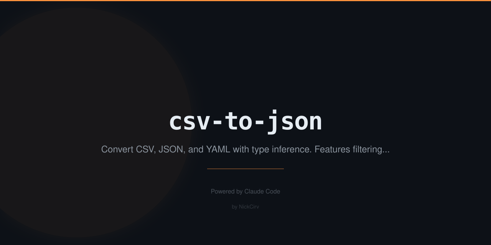

# csv-to-json

Convert CSV↔JSON↔YAML with type inference, filtering, schema detection, and streaming support.

**Zero external dependencies.** Built-in Node.js modules only (`fs`, `path`, `readline`). Node 18+.

---

## Install

```bash
npm install -g csv-to-json
# or
npx csv-to-json <input.csv>
```

Also available as `c2j` short alias after global install.

---

## Usage

```
csv-to-json <input>          Convert file (format inferred from extension)
csv-to-json                  Read from stdin
cat file.csv | csv-to-json

OPTIONS
  --format <fmt>       Output format: json | yaml | csv  (default: json)
  --from <fmt>         Input format override: csv | json | yaml
  --delimiter <char>   Force CSV delimiter (default: auto-detect , | \t ; |)
  --no-header          First row is data, not headers (cols named col0, col1...)
  --types              Enable type inference (numbers, booleans, null, ISO dates)
  --pretty             Pretty-print JSON output (default: compact)
  --schema             Print inferred schema and exit
  --output <file>      Write output to file instead of stdout
  --limit <n>          Only process first n data rows
  --filter <f>=<v>     Filter rows where field equals value
  --select <f1,f2>     Select only these columns (comma-separated)
  --help, -h           Show this help
```

---

## Examples

### CSV to JSON

```bash
csv-to-json data.csv
# [{"id":"1","name":"Alice Johnson","age":"29",...}]

csv-to-json data.csv --types --pretty
# Numbers, booleans, dates inferred automatically
```

### CSV to YAML

```bash
csv-to-json data.csv --format yaml
# - id: 1
#   name: Alice Johnson
#   age: 29
```

### JSON / YAML to CSV

```bash
csv-to-json data.json
# id,name,age
# 1,Alice Johnson,29

csv-to-json data.yaml --format csv
```

### Schema Inference

```bash
csv-to-json data.csv --schema
# Schema inference:
# ────────────────────────────────────────────────────────────
#   id: number
#   samples: "1", "2", "3"
#   name: string
#   age: number
#   join_date: date
#   active: string (infer boolean with --types)
```

### Filter and Select Columns

```bash
csv-to-json data.csv --filter country=UK --select name,age,salary --types --pretty
# Only UK rows, three columns, with type inference
```

### Pipe Support

```bash
cat data.csv | csv-to-json --format yaml
cat data.csv | csv-to-json --types | jq '.[0]'
```

### Write to File

```bash
csv-to-json data.csv --format yaml --output output.yaml
csv-to-json data.csv --types --pretty --output data.json
```

### Large Files (Streaming)

CSV input is always streamed via `readline` — handles files of any size without loading everything into memory.

```bash
csv-to-json huge.csv --limit 1000 --format yaml
```

### Tab / Pipe / Semicolon Delimiters

```bash
csv-to-json data.tsv                        # auto-detected
csv-to-json data.csv --delimiter "|"        # forced
csv-to-json data.csv --delimiter ";"        # semicolon
```

### No-Header CSVs

```bash
csv-to-json data.csv --no-header
# Columns named col0, col1, col2, ...
```

---

## Type Inference (`--types`)

When `--types` is enabled, string values are cast to their proper types:

| Input string | Inferred type | Output |
|---|---|---|
| `"42"` | number | `42` |
| `"3.14"` | number | `3.14` |
| `"true"` / `"True"` / `"TRUE"` | boolean | `true` |
| `"false"` / `"False"` / `"FALSE"` | boolean | `false` |
| `""` / `"null"` / `"NULL"` / `"N/A"` | null | `null` |
| `"2024-01-15"` | date string (validated ISO 8601) | `"2024-01-15"` |
| everything else | string | unchanged |

---

## YAML Support

YAML serialization and parsing are implemented in pure JavaScript — no `js-yaml` or any other dependency. Supports:

- Block-style arrays of objects (the most common ETL format)
- Proper quoting of strings with special YAML characters
- Numbers, booleans, nulls

---

## Security

- Zero external npm dependencies — no supply-chain risk
- All I/O via built-in `fs` and `readline` only
- No `eval`, no `exec`, no shell spawning

---

## License

MIT
