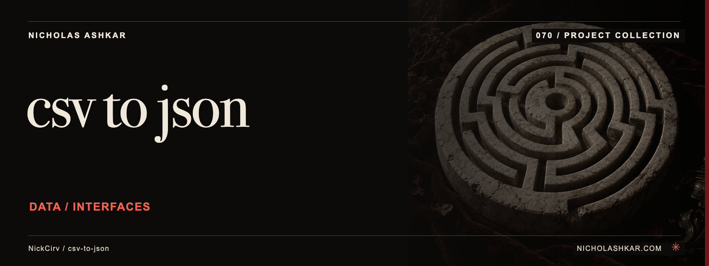

# csv-to-json

Converts tabular CSV, JSON and a limited YAML subset, with optional selection and type inference.


<a id="usage"></a>

<a id="csv--json-default"></a>

<a id="csv--yaml-with-type-inference"></a>

<a id="json-or-yaml--csv"></a>

<a id="pipe-from-stdin"></a>

<a id="inspect-inferred-schema"></a>

## What it does

- Format/delimiter selection.
- Filtering and field projection.
- Schema inference.
- File/stdin input.
- Optional output file.


<a id="install"></a>

## Quickstart

Prerequisites: Node.js `>=20` and npm. The checkout below pins the source used for this documentation.

```sh
git clone https://github.com/NickCirv/csv-to-json.git
cd csv-to-json
git checkout 3ce07cf7a9a0a91ff553387dd06a581ce1eecbe3
```

In the cloned directory:

Save this small fixture as `people.csv`:

```csv
name,age
Ada,36
Sam,20
```

```sh
node index.js people.csv --types --pretty
```

**Expected behavior (illustrative, not captured):** Reads the fixture above and prints JSON rows with numeric ages.

Examples are source-inspected, **not runtime-tested**. See the research record for verification gaps.

## Boundaries and data

The YAML parser is limited and CSV handling is not a general spreadsheet engine. Type inference can change identifiers such as leading-zero values; leave it off when exact strings matter.

## Development

The manifest defines `npm test` as:

```sh
node --test
```

The captured suite is a smoke check, not end-to-end behavior coverage. Examples include “entry is valid JavaScript”. Tests were not run for this documentation revision.

See [implementation and command reference](docs/REFERENCE.md) for the package scripts and inspected interfaces, and [research record](docs/RESEARCH.md) for the pinned source, document decisions and unresolved checks.

## License and contact

See [LICENSE](LICENSE) for the original terms and attribution. Legal text is unchanged.

[Nicholas Ashkar](https://nicholashkar.com/) · [Discuss a project](https://nicholashkar.com/#oxblood-contact)
